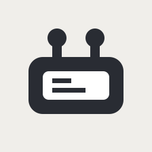
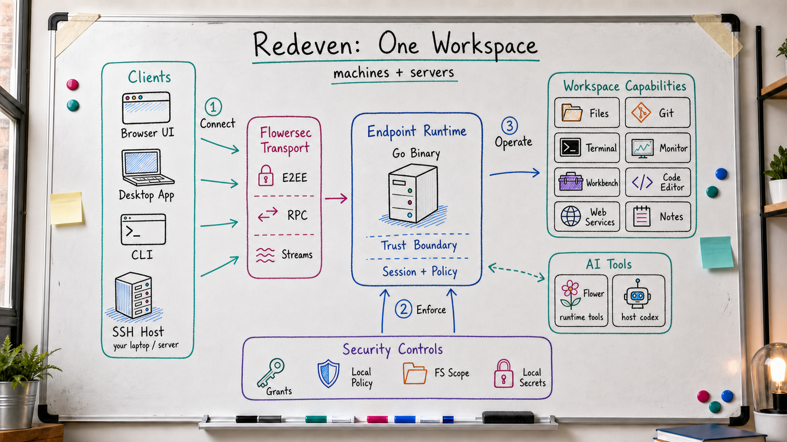

<p align="center">
  
</p>

# Redeven

<!-- readme-locales:start -->
<p align="center">
  <a href="README.md">English</a> |
  <a href="README.zh-CN.md">简体中文</a> |
  <a href="README.zh-TW.md">繁體中文</a> |
  <a href="README.ja-JP.md">日本語</a> |
  <a href="README.ko-KR.md">한국어</a> |
  <a href="README.de-DE.md">Deutsch</a> |
  <a href="README.fr-FR.md">Français</a> |
  <strong>Español</strong> |
  <a href="README.pt-BR.md">Português do Brasil</a> |
  <a href="README.ru-RU.md">Русский</a>
</p>
<!-- readme-locales:end -->

<p align="center">
  <strong>Tus ordenadores y servidores, en una sola pestaña del navegador.</strong><br>
  Terminal, explorador de archivos, IDE e IA,
  <br>todo en tu propio hardware y con cifrado de extremo a extremo.
</p>

<p align="center">
  <a href="https://github.com/floegence/redeven/releases">Descargar Desktop</a> |
  <a href="#quick-start">Instalar la CLI</a> |
  <a href="#what-you-can-do">Funciones</a> |
  <a href="#security">Seguridad</a> |
  <a href="#documentation">Documentación</a>
</p>

<p align="center">
  <a href="https://go.dev/"></a>
  <a href="https://nodejs.org/"></a>
  <a href="okf/index.md"></a>
  <a href="https://github.com/floegence/redeven/releases"></a>
</p>

<p align="center">
  
</p>

<!-- readme-section:what-is-redeven -->
<a id="what-is-redeven"></a>

## ¿Qué es Redeven?

Redeven es un único binario que reúne tus ordenadores y servidores en una pestaña del navegador. En lugar de alternar entre terminales SSH, exploradores de archivos, paneles de supervisión, reenvíos de puertos y ventanas del IDE, obtienes un espacio de trabajo unificado en el hardware que ya controlas.

Se ejecuta en tu equipo, en servidores remotos o en cualquier host SSH accesible. Tus archivos, procesos, claves de API y credenciales permanecen donde deben estar: Redeven no mueve tus datos en texto claro a través de infraestructura ajena.

- **Los clientes se conectan a un entorno de ejecución del endpoint**: el navegador, Desktop, la CLI y las sesiones alojadas mediante SSH entran en el mismo espacio de trabajo administrado por el entorno de ejecución.
- **El entorno de ejecución es el límite de confianza**: un único binario de Go gestiona archivos, terminales, supervisión, Git, reenvío de servicios web, la disposición de Workbench, notas, la configuración de Browser Editor y Flower.
- **El transporte y las políticas se mantienen explícitos**: Flowersec transporta el tráfico RPC y de streams cifrado, mientras que las concesiones de sesión, la política local de permisos, el alcance del sistema de archivos y los secretos locales limitan lo que puede hacer cada sesión.



<!-- readme-section:quick-start -->
<a id="quick-start"></a>

## Inicio rápido

Hay dos formas de empezar: Desktop, recomendado para la mayoría de usuarios, o la CLI.

<!-- readme-section:desktop-app -->
<a id="desktop-app"></a>

### Aplicación Desktop

1. Descarga Redeven Desktop desde [GitHub Releases](https://github.com/floegence/redeven/releases). Las versiones públicas ofrecen actualmente instaladores para macOS y Linux. Windows 11 x64 seguirá siendo una compilación interna de certificación WSL hasta que se habiliten la firma de código y la verificación de actualizaciones firmadas.
2. Abre la aplicación. En macOS o Linux, elige un entorno local, Redeven Cloud, un host SSH o una URL guardada. En Windows, registra una distribución WSL 2 inicializada en el centro de entornos. Desktop no proporciona un entorno local nativo, un entorno de ejecución de Windows ni un entorno de ejecución de contenedor local.
3. Empieza a trabajar: el espacio de trabajo se abre automáticamente en el navegador.

Cada distribución registrada es un entorno WSL independiente. Desktop transfiere el entorno de ejecución Linux x64 correspondiente al directorio `~/.redeven` del usuario de la distribución. No instala ni administra WSL, no usa `/mnt/c` ni depende de `systemd`. Cerrar, actualizar o desinstalar Desktop no detiene el entorno de ejecución WSL ni elimina sus datos. Usa la acción Detener del entorno cuando quieras detenerlo.

Para equipos remotos, Desktop puede instalar automáticamente la versión correspondiente de Redeven mediante SSH y, cuando lo elijas, conectar explícitamente ese entorno de ejecución SSH administrado a un entorno de Redeven Cloud. No es necesario configurar manualmente el host remoto.

<!-- readme-section:cli -->
<a id="cli"></a>

### CLI

```bash
# 1. Instalar
curl -fsSL https://raw.githubusercontent.com/floegence/redeven/main/scripts/install.sh | sh

# 2. Generar la CA del dispositivo de Local UI (una vez)
redeven local-authority device-ca generate --state-root ~/.redeven

# macOS o Windows: instalarla en el almacén de confianza del usuario actual
redeven local-authority device-ca install --state-root ~/.redeven --scope user

# Linux: exportar el certificado público y después importarlo manualmente
redeven local-authority device-ca export --state-root ~/.redeven --output ~/.redeven/local-ui-device-ca.pem

# 3. Ejecutar
redeven run

# 4. Abrir https://localhost:23998 en el navegador.
```

En Linux, importa el certificado público exportado en el almacén de confianza que use realmente tu navegador o cliente. `install --scope user` devuelve `manual_required` de forma intencionada en Linux; Redeven nunca ejecuta `sudo` ni modifica un almacén de confianza de todo el sistema. El entorno de ejecución valida la identidad de la CA y el certificado de servidor generado antes de servir HTTPS/WSS, pero no puede establecer la confianza del cliente por ti. Por tanto, la conexión TLS del cliente falla de forma segura hasta que ese navegador o cliente confía en la CA.

La primera ejecución de `redeven run` inicializa el estado local en `~/.redeven/local-environment/` y arranca en modo local. No hace falta realizar el bootstrap ni configurar el plano de control. Local UI escucha en `localhost:23998` y solo está disponible desde este dispositivo; no admite el acceso directo desde una LAN ni desde una red pública. Pulsa Ctrl+C para detener el entorno de ejecución.

Ejecuta `redeven help run` para consultar otros modos de ejecución y la protección local opcional mediante contraseña.

<!-- readme-section:what-you-can-do -->
<a id="what-you-can-do"></a>

## Qué puedes hacer

| Superficie | Funciones disponibles |
|---|---|
| Archivos y Git | Subida y descarga de archivos, vista previa y edición en línea, cambios de Git limitados por carpeta, diferencias y flujos de stash. |
| Terminal | Terminales con varias pestañas que parten de tus directorios de trabajo y usan el mismo modelo de permisos del entorno de ejecución. |
| Monitor | Vistas de CPU, memoria, disco, red y procesos procedentes del entorno de ejecución del endpoint. |
| Browser Editor | Sesiones del editor en el navegador configuradas explícitamente por Desktop y aisladas por espacio de trabajo. |
| Servicios web | Registro de servicios y acceso con reenvío de puertos administrados por el entorno de ejecución, sin túneles SSH escritos a mano. |
| Containers | Gestión nativa de contenedores Docker y Podman, imágenes, volúmenes, Compose Projects y Pods, con registros, estadísticas y protección de propiedad de los servicios web. |
| Flower | Superficies de IA opcionales que usan herramientas validadas por el entorno de ejecución y configuración local del modelo y del host. |
| Desktop | Iniciador nativo para entornos locales, entornos alojados en Redeven Cloud, entornos inicializados mediante SSH y entornos de Local UI guardados. |

<!-- readme-section:security -->
<a id="security"></a>

## Seguridad sin restar protagonismo

Redeven da prioridad a las funciones, pero el entorno de ejecución sigue siendo el límite de confianza porque controla el host real.

- El entorno de ejecución reside en el endpoint y mantiene allí los datos en texto claro.
- El plano de control emite cargas de inicialización, concesiones y metadatos de sesión inmutables.
- [Flowersec](https://github.com/floegence/flowersec) transporta bytes cifrados entre el cliente y el entorno de ejecución del endpoint. Las superficies del navegador usan Flowersec Core 5.0.1 y el módulo Go `flowersec-go/v5@v5.0.1`.
- Los permisos efectivos proceden de concesiones de sesión emitidas por el servidor y quedan limitados por la política local (`read`, `write`, `execute`, `admin`; ninguna categoría implica otra).
- La configuración local, el material E2EE, los registros de auditoría y los diagnósticos permanecen en el directorio de estado del endpoint.
- GitHub Releases sigue siendo la fuente pública de referencia para binarios, sumas de comprobación, firmas y recursos de verificación de OKF.

<!-- readme-section:documentation -->
<a id="documentation"></a>

## Documentación

Redeven mantiene el conocimiento del repositorio en [OKF v0.1](okf/index.md). El corpus de OKF se genera a partir del comportamiento actual del código fuente y se integra en el entorno de ejecución para `okf.search`.

La superficie de integración RCPP Provider legible por máquinas se encuentra en [spec/openapi/rcpp-v2.yaml](spec/openapi/rcpp-v2.yaml). Fuera de OKF, los archivos Markdown mantenidos se limitan deliberadamente a `AGENTS.md`, `THIRD_PARTY_NOTICES.md`, el archivo canónico `README.md` y las traducciones compatibles `README.<locale>.md` declaradas en `assets/readme/locales.json`.

<!-- readme-section:for-developers -->
<a id="for-developers"></a>

## Para desarrolladores

Compila, ejecuta el lint y verifica el proyecto desde el código fuente.

<details>
<summary>Compilar desde el código fuente</summary>

<!-- readme-section:prerequisites -->
<a id="prerequisites"></a>

### Requisitos previos

- Go `1.27.0`
- Node.js `26.7.0`
- npm
- pnpm o Node.js `corepack`

<!-- readme-section:build -->
<a id="build"></a>

### Compilación

```bash
./scripts/lint_ui.sh
./scripts/check_desktop.sh
./scripts/build_assets.sh
go build -o redeven ./cmd/redeven
```

<!-- readme-section:local-guardrails -->
<a id="local-guardrails"></a>

### Protecciones locales

```bash
./scripts/install_git_hooks.sh
node scripts/generate_third_party_notices.mjs --check
```

Notas:

- Los recursos `internal/**/dist/` se generan y se integran mediante Go `embed`.
- Los recursos frontend de `dist` no se registran en Git. La excepción versionada es `okf/dist/*`, que permanece en el repositorio como metadatos verificables de publicación del paquete OKF.
- `THIRD_PARTY_NOTICES.md` se genera a partir de módulos Go y archivos de bloqueo de JavaScript. Ejecuta `node scripts/generate_third_party_notices.mjs` después de cambiar dependencias y mantén `--check` en verde.
- `./scripts/lint_ui.sh`, `./scripts/check_desktop.sh`, `./scripts/build_assets.sh` y `go test ./...` son las principales comprobaciones a nivel de código fuente.
- `./scripts/dev_desktop.sh` inicia Desktop desde el checkout o worktree actual con un entorno de ejecución recién empaquetado.
- `cd desktop && npm run start` y `cd desktop && npm run package` preparan `desktop/.bundle/<goos>-<goarch>/redeven` antes de que Electron inicie o empaquete el shell de Desktop.

</details>

<details>
<summary>Estado local, rutas de publicación y resolución de problemas</summary>

- El estado del entorno local se guarda de forma predeterminada en `~/.redeven/local-environment/`. Desktop y el modo independiente del entorno de ejecución también comparten el catálogo de perfiles en `~/.redeven/catalog/`.
- GitHub Releases es la fuente pública de referencia para los archivos tar versionados de la CLI, los instaladores de Desktop, las sumas de comprobación, las firmas y los recursos de verificación de OKF.
- Para consultar detalles actuales de implementación, busca en el paquete OKF integrado con `okf.search` o revisa [okf/index.md](okf/index.md).

</details>

<!-- readme-section:license -->
<a id="license"></a>

## Licencia

Redeven se distribuye bajo la [MIT License](LICENSE). Los avisos de dependencias de terceros se mantienen en [THIRD_PARTY_NOTICES.md](THIRD_PARTY_NOTICES.md). Los archivos comprimidos de las versiones y los paquetes de Desktop incluyen estos archivos junto a los artefactos del entorno de ejecución.

<!-- readme-section:open-source-scope -->
<a id="open-source-scope"></a>

## Alcance del código abierto

Este repositorio público cubre la capa de endpoint y entorno de ejecución, el comportamiento de Redeven Local UI, el shell de Desktop y el contrato de GitHub Release.

La automatización de despliegue específica de cada organización, las implementaciones del plano de control y los envoltorios de empaquetado específicos de cada sitio quedan deliberadamente fuera del alcance.
