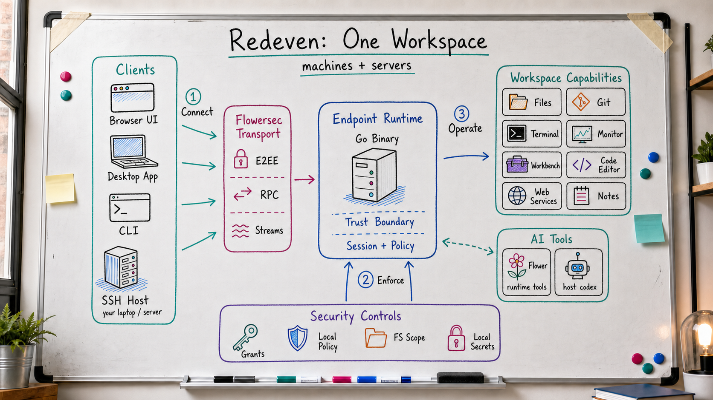

<p align="center">
  
</p>

# Redeven

<!-- readme-locales:start -->
<p align="center">
  <strong>English</strong> |
  <a href="README.zh-CN.md">简体中文</a> |
  <a href="README.zh-TW.md">繁體中文</a> |
  <a href="README.ja-JP.md">日本語</a> |
  <a href="README.ko-KR.md">한국어</a> |
  <a href="README.de-DE.md">Deutsch</a> |
  <a href="README.fr-FR.md">Français</a> |
  <a href="README.es-ES.md">Español</a> |
  <a href="README.pt-BR.md">Português do Brasil</a> |
  <a href="README.ru-RU.md">Русский</a>
</p>
<!-- readme-locales:end -->

<p align="center">
  <strong>Your computers &amp; servers, in one browser tab.</strong><br>
  Terminal, file browser, IDE, and AI —
  <br>all on your own hardware, end-to-end encrypted.
</p>

<p align="center">
  <a href="https://github.com/floegence/redeven/releases">Download Desktop</a> |
  <a href="#quick-start">Install CLI</a> |
  <a href="#what-you-can-do">Features</a> |
  <a href="#security">Security</a> |
  <a href="#documentation">Docs</a>
</p>

<p align="center">
  <a href="https://go.dev/"></a>
  <a href="https://nodejs.org/"></a>
  <a href="okf/index.md"></a>
  <a href="https://github.com/floegence/redeven/releases"></a>
</p>

<!-- readme-section:what-is-redeven -->
<a id="what-is-redeven"></a>

## What is Redeven?

Redeven is a single binary that brings your computers and servers into one browser tab. Instead of juggling SSH terminals, file browsers, monitoring dashboards, port forwarding, and IDE windows, you get one unified workspace on the hardware you already control.

It runs on your machine, your remote servers, or any reachable SSH host. Your files, processes, API keys, and credentials stay where they belong — Redeven does not move your plaintext through anyone else's infrastructure.

- **Clients connect to an endpoint runtime** — Browser, Desktop, CLI, and SSH-hosted sessions all enter the same runtime-managed workspace.
- **The runtime is the trust boundary** — a single Go binary owns files, terminals, monitoring, Git, web-service forwarding, Workbench layout, notes, Browser Editor setup, Flower, and Codex bridge access.
- **Transport and policy stay explicit** — Flowersec carries encrypted RPC and stream traffic, while session grants, local permission policy, filesystem scope, and local secrets constrain what each session can do.



<!-- readme-section:quick-start -->
<a id="quick-start"></a>

## Quick start

Two paths to get started: Desktop (recommended for most users) or CLI.

<!-- readme-section:desktop-app -->
<a id="desktop-app"></a>

### Desktop App

1. Download Redeven Desktop from [GitHub Releases](https://github.com/floegence/redeven/releases).
2. Open the app. Choose your environment: Local, Provider, SSH Host, or a saved URL.
3. Start working — the workspace opens in your browser automatically.

For remote machines: Desktop can auto-install the matching Redeven release over SSH, then explicitly connect that managed SSH runtime to a provider Environment when you choose to. No manual setup on the remote host.

<!-- readme-section:cli -->
<a id="cli"></a>

### CLI

```bash
# 1. Install
curl -fsSL https://raw.githubusercontent.com/floegence/redeven/main/scripts/install.sh | sh

# 2. Bootstrap (one-time, read the ticket from a protected secret file)
redeven bootstrap \
  --provider-origin https://<your-provider> \
  --controlplane https://<your-access-point> \
  --env-id <env_public_id> \
  --bootstrap-ticket-file /run/secrets/redeven-bootstrap-ticket

# 3. Run
redeven run --mode hybrid

# 4. Open http://localhost:23998 in your browser.
```

Bootstrap writes non-secret Local Environment metadata to `~/.redeven/local-environment/config.json` and runtime credentials to the permission-restricted `~/.redeven/local-environment/secrets.json`. Each OS user has one Local Environment identity, bound to one provider Environment at a time. Desktop and browser flows use the same one-time ticket contract.

For an interactive one-time setup, replace `--bootstrap-ticket-file ...` above with `--bootstrap-ticket-stdin`. Redeven then prompts for the ticket without echoing it. When stdin is a pipe or redirect, the same flag reads the ticket directly without printing a prompt.

For automation, secret managers, CI runners, and container orchestrators may inject `REDEVEN_BOOTSTRAP_TICKET` and `REDEVEN_LOCAL_UI_PASSWORD` directly. Environment variables remain observable to same-user processes, debuggers, and the host platform, so prefer hidden prompts, stdin, or protected secret files for interactive use.

Interactive terminals use Redeven's rich runtime presentation by default: a compact animated character mark, runtime version/protocol details, active session/workload counts, Local UI and Environment URLs, real runtime log tailing, and actionable warning/error panels. Use the arrow keys to move between Control plane, Sessions, and Logs. Press Enter on Sessions to open a filterable active-session view, Enter on Logs to expand the full runtime log view, Enter on Control plane to connect, disconnect, or open the bootstrap setup fields, Esc to return, and Ctrl+C to stop the runtime. Non-interactive shells fall back to plain text, and Desktop-managed launches use the machine presentation contract with structured startup reports instead of terminal UI.

**Run modes at a glance:**

| Goal | Command |
|---|---|
| Local UI only (this device) | `redeven run --mode local` |
| Local UI + remote control channel | `redeven run --mode hybrid` |
| Desktop-managed runtime | `redeven run --mode desktop --desktop-managed --presentation machine --local-ui-bind localhost:23998` |
| Access from another device | Keep Local UI on loopback and use Redeven Desktop, SSH forwarding, or a Flowersec secure tunnel. |

<!-- readme-section:what-you-can-do -->
<a id="what-you-can-do"></a>

## What you can do

| Surface | What it gives you |
|---|---|
| Files and Git | File upload/download, inline preview/edit, folder-scoped Git changes, diffs, and stash workflows. |
| Terminal | Multi-tab terminals rooted in the directories you are working with, under the same runtime permission model. |
| Monitor | CPU, memory, disk, network, and process views from the endpoint runtime. |
| Browser Editor | Browser editor sessions set up explicitly by Desktop, isolated per workspace. |
| Web Services | Runtime-managed service registration and port-forward access without hand-written SSH tunnels. |
| Flower and Codex | Optional AI surfaces that use runtime-validated tools and local model/host configuration. |
| Desktop | Native launcher for local, provider-hosted, SSH-bootstrapped, and saved Local UI environments. |

<!-- readme-section:security -->
<a id="security"></a>

## Security, without stealing the spotlight

Redeven leads with capability, but the runtime is still the trust boundary because it owns the real host.

- The runtime lives on the endpoint and keeps plaintext there.
- The control plane issues bootstrap payloads, grants, and immutable session metadata.
- [Flowersec](https://github.com/floegence/flowersec) carries encrypted bytes between the client and the endpoint runtime; current runtime integration is documented against `flowersec-go/v0.20.2`.
- Effective permissions come from server-issued session grants, clamped by the local permission policy (`read`, `write`, `execute`, `admin` — no category implies any other).
- Local config, E2EE material, audit logs, and diagnostics stay in the endpoint state directory.
- GitHub Releases remain the public source of truth for binaries, checksums, signatures, and OKF verification assets.

<!-- readme-section:documentation -->
<a id="documentation"></a>

## Documentation

Redeven keeps maintained repository knowledge in [OKF v0.1](okf/index.md). The OKF corpus is generated from current source-level behavior and is embedded into the runtime for `okf.search`.

Machine-readable provider integration surface lives in [spec/openapi/rcpp-v2.yaml](spec/openapi/rcpp-v2.yaml). Outside OKF, maintained Markdown is intentionally limited to `AGENTS.md`, `THIRD_PARTY_NOTICES.md`, the canonical `README.md`, and the supported `README.<locale>.md` translations declared in `assets/readme/locales.json`.

<!-- readme-section:for-developers -->
<a id="for-developers"></a>

## For developers

Build, lint, and verify from source.

<details>
<summary>Build from source</summary>

<!-- readme-section:prerequisites -->
<a id="prerequisites"></a>

### Prerequisites

- Go `1.26.3`
- Node.js `24`
- npm
- pnpm or Node.js `corepack`

<!-- readme-section:build -->
<a id="build"></a>

### Build

```bash
./scripts/lint_ui.sh
./scripts/check_desktop.sh
./scripts/build_assets.sh
go build -o redeven ./cmd/redeven
```

<!-- readme-section:local-guardrails -->
<a id="local-guardrails"></a>

### Local guardrails

```bash
./scripts/install_git_hooks.sh
node scripts/generate_third_party_notices.mjs --check
```

Notes:

- `internal/**/dist/` assets are generated and embedded via Go `embed`.
- Frontend `dist` assets are not checked into git. The tracked exception is `okf/dist/*`, which stays committed as verifiable OKF bundle release metadata.
- `THIRD_PARTY_NOTICES.md` is generated from Go modules and JavaScript lockfiles. Run `node scripts/generate_third_party_notices.mjs` after dependency changes, then keep `--check` green.
- `./scripts/lint_ui.sh`, `./scripts/check_desktop.sh`, `./scripts/build_assets.sh`, and `go test ./...` are the main source-level checks.
- `./scripts/dev_desktop.sh` starts Desktop from the current checkout or worktree with a freshly bundled runtime.
- `cd desktop && npm run start` and `cd desktop && npm run package` prepare `desktop/.bundle/<goos>-<goarch>/redeven` before Electron starts or packages the desktop shell.

</details>

<details>
<summary>Local state, release paths, and troubleshooting</summary>

- Local Environment state defaults to `~/.redeven/local-environment/`; Desktop and standalone runtime mode also share the profile catalog under `~/.redeven/catalog/`.
- GitHub Releases are the public source of truth for versioned CLI tarballs, Desktop installers, checksums, signatures, and OKF verification assets.
- For current implementation details, query the embedded OKF bundle with `okf.search` or inspect [okf/index.md](okf/index.md).

</details>

<!-- readme-section:license -->
<a id="license"></a>

## License

Redeven is licensed under the [MIT License](LICENSE). Third-party dependency notices are tracked in [THIRD_PARTY_NOTICES.md](THIRD_PARTY_NOTICES.md); release archives and Desktop packages include these files alongside the runtime artifacts.

<!-- readme-section:open-source-scope -->
<a id="open-source-scope"></a>

## Open-source scope

This public repository covers the endpoint/runtime layer, Redeven Local UI behavior, the desktop shell, and the GitHub Release contract.

Organization-specific deployment automation, control-plane implementations, and site-specific packaging wrappers are intentionally out of scope here.
