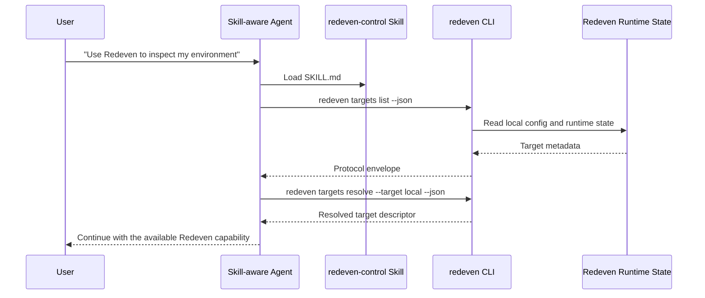
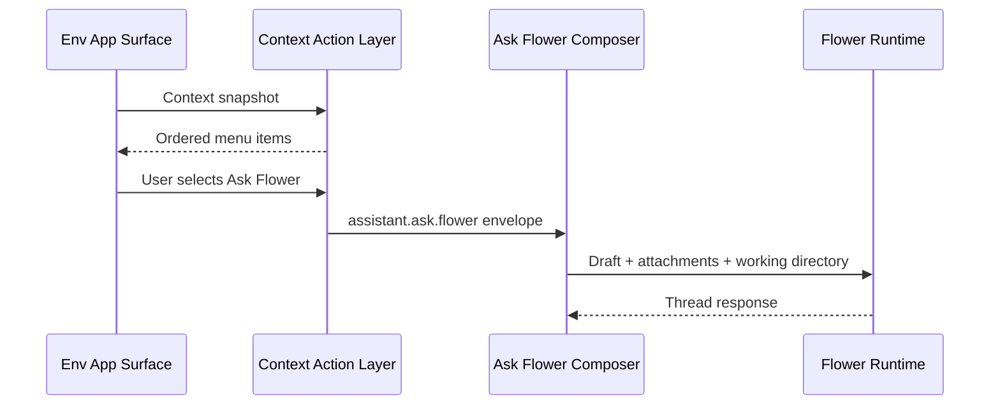

# Agent Skills and Context Actions

Redeven exposes external AI-agent integration through **Agent Skills**, not MCP.

The contract is intentionally small:

- Skills provide agent-facing workflow instructions.
- The `redeven` CLI provides stable JSON envelopes and target discovery.
- The runtime remains the security boundary for sessions, permissions, tools, and audit fields.
- Env App right-click actions use a shared Context Action envelope so Files, Terminal, Monitor, Git, Flower, and Codex speak the same action language.

## Current Scope

The current checked-in contract supports:

- official skill bundles under `agent-skills/`;
- target discovery through `redeven targets list`;
- target resolution through `redeven targets resolve`;
- a Context Action Protocol for Env App assistant and handoff actions;
- compatibility mapping from existing Ask Flower intents into Context Action envelopes.

The CLI only reports capabilities that are discoverable from local runtime state and local configuration. Remote mutation must go through runtime-authorized commands and is not implied by target discovery metadata.

## Skill Bundles

The repository ships two skill bundles:

| Skill | Purpose |
| --- | --- |
| `agent-skills/redeven-control` | Discover and resolve Redeven targets from Claude Code, Codex, OpenCode, Cline, or another skill-aware agent. |
| `agent-skills/redeven-assist` | Keep assistant handoffs consistent when users ask for Ask Flower, Ask Codex, or context-aware help. |

Skill clients should install or reference the relevant `SKILL.md` folder according to their own skill-loading rules. The skill body is the integration surface; no MCP server is required.

## CLI Envelope

All skill-facing JSON commands use the same envelope:

```json
{
  "schema_version": 1,
  "ok": true,
  "data": {},
  "error": null,
  "trace": {
    "request_id": "req_0123456789abcdef",
    "target_id": "local:local",
    "source": "redeven_cli"
  }
}
```

On failure:

```json
{
  "schema_version": 1,
  "ok": false,
  "error": {
    "code": "TARGET_NOT_FOUND",
    "message": "target not found"
  },
  "trace": {
    "request_id": "req_0123456789abcdef",
    "target_id": "missing",
    "source": "redeven_cli"
  }
}
```

Agents must check `ok` before using `data`.

## Target Descriptor

`redeven targets list --json` returns:

```json
{
  "targets": [
    {
      "id": "local:local",
      "kind": "local_environment",
      "label": "Local Environment",
      "status": "available",
      "state_root": "/Users/alice/.redeven",
      "state_dir": "/Users/alice/.redeven/local-environment",
      "config_path": "/Users/alice/.redeven/local-environment/config.json",
      "runtime_state_path": "/Users/alice/.redeven/local-environment/runtime/local-ui.json",
      "local_ui_url": "http://127.0.0.1:23998/",
      "env_public_id": "env_123",
      "local_environment_public_id": "le_123",
      "capabilities": ["codex_gateway", "files", "flower", "git", "local_ui", "monitor", "remote_control", "terminal"]
    }
  ]
}
```

Status values:

- `available`: a runtime state file exposes an attachable Local UI URL.
- `configured`: local configuration exists, but no current runtime state was found.
- `not_configured`: the Local Environment state root is known, but no config exists yet.

Capability values:

- `local_ui`: a Local UI URL is available.
- `remote_control`: the Local Environment is bound to a control-plane environment.
- `files`: Env App file APIs are available through the running gateway.
- `terminal`: terminal APIs are available through the running gateway.
- `monitor`: monitor APIs are available through the running gateway.
- `git`: Git browser APIs are available through the running gateway.
- `flower`: Flower is configured in local runtime config.
- `codex_gateway`: the running Env App gateway can expose Codex diagnostics and Codex requests if the host binary is available.

## Commands

List targets:

```bash
redeven targets list --json
```

Resolve one target:

```bash
redeven targets resolve --target local --json
redeven targets resolve --target local:local --json
redeven targets resolve --target env_123 --json
```

Both commands accept:

```bash
--state-root <path>
```

for isolated profiles or tests.

## Context Action Protocol

Env App context actions use this shape:

```json
{
  "schema_version": 1,
  "action_id": "assistant.ask.flower",
  "provider": "flower",
  "target": {
    "target_id": "current",
    "locality": "auto"
  },
  "source": {
    "surface": "file_browser",
    "surface_id": "files-main"
  },
  "context": [
    {
      "kind": "file_path",
      "path": "/workspace/repo/main.go",
      "is_directory": false
    }
  ],
  "presentation": {
    "label": "Ask Flower",
    "priority": 100
  },
  "suggested_working_dir_abs": "/workspace/repo"
}
```

Action ids:

- `assistant.ask.flower`
- `assistant.ask.codex`
- `handoff.terminal.open`
- `handoff.files.browse`

Assistant locality values:

- `auto`: the router should use the best currently available assistant runtime.
- `current_runtime`: execute in the current Env App runtime.
- `local_model_remote_target`: use a local model source while binding tools to a remote target. In Redeven Desktop SSH Host sessions this is implemented by the Desktop AI Broker: model calls use the Desktop Local Environment's provider config and secrets, while file, terminal, Git, monitor, and port tools still execute inside the SSH-hosted runtime.
- `remote_runtime`: execute in the target runtime.

The current UI maps existing Ask Flower entries into `assistant.ask.flower` envelopes. This keeps compatibility while giving additional assistant providers the same context structure.

## Right-Click Menu Model

Assistant and handoff actions share one priority order:

```text
+-----------------------------+
| Ask Flower                  |
| Ask Codex                   |
+-----------------------------+
| Open in Terminal            |
| Browse Files                |
+-----------------------------+
| Surface-specific actions... |
+-----------------------------+
```

Surface components should provide context, not assistant-specific prompt logic. The shared action layer owns action identity, ordering, provider selection, and fallback labels.

## External Agent Flow



## Env App Context Flow



## Security Notes

- Session permissions remain runtime-authoritative through `session.Meta`.
- Agent Skills do not receive long-lived credentials.
- CLI target discovery reads local configuration and runtime state only.
- Browser-provided permission or app fields are not trusted by runtime handlers.
- Skills must report unsupported capabilities instead of bypassing Redeven through ad hoc shell scripts.
