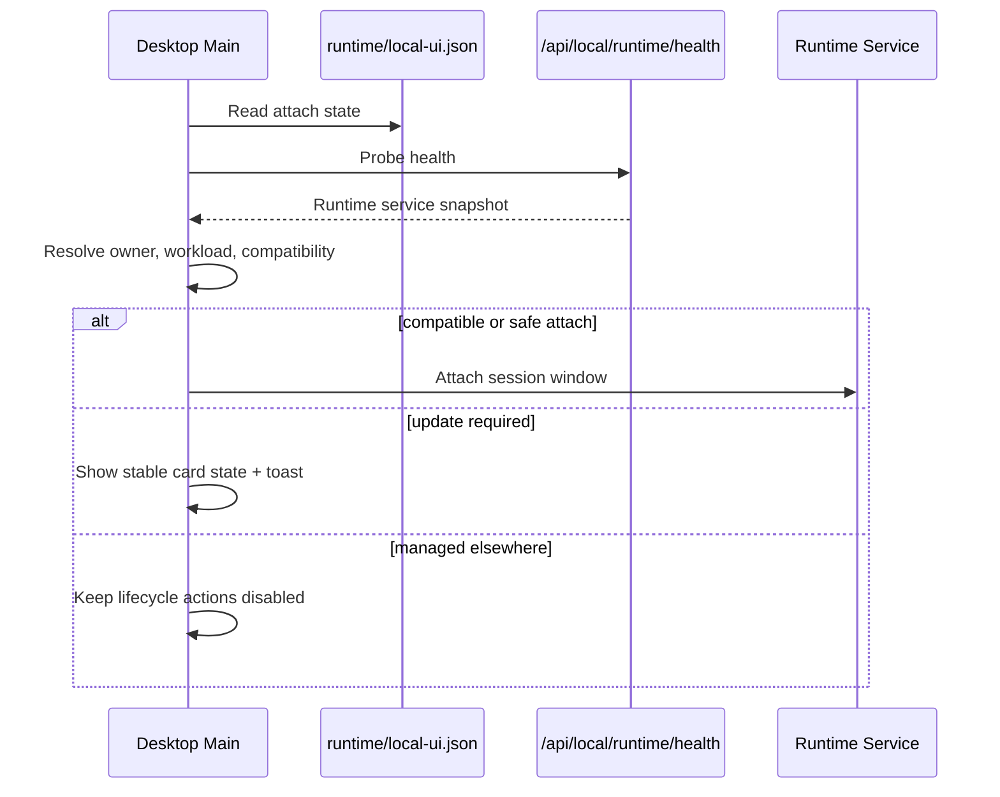
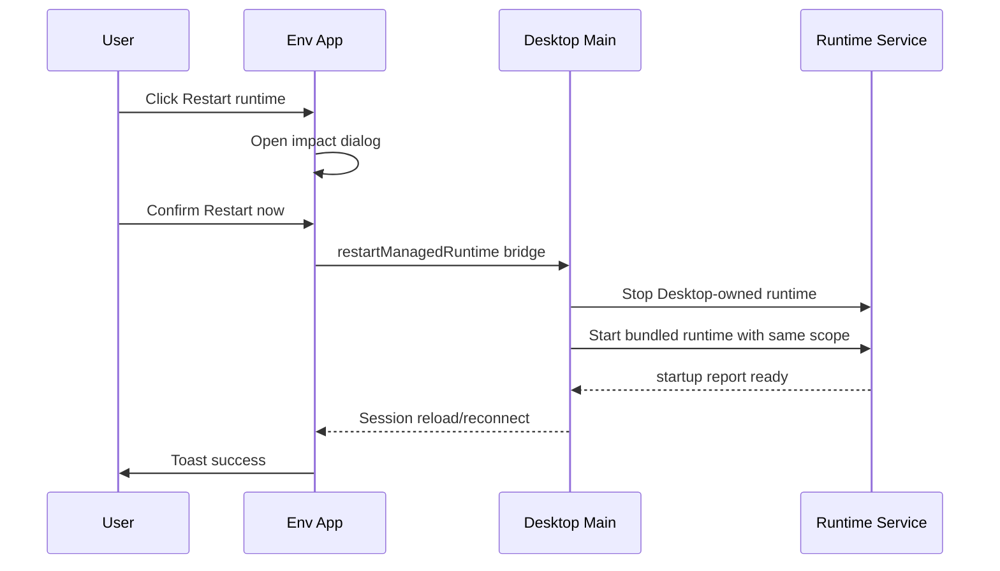
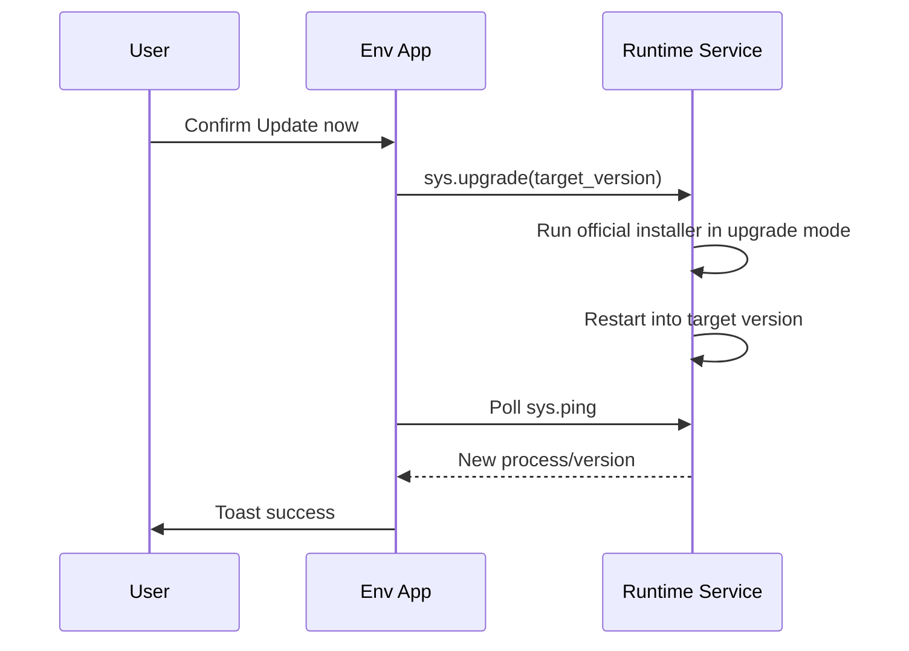
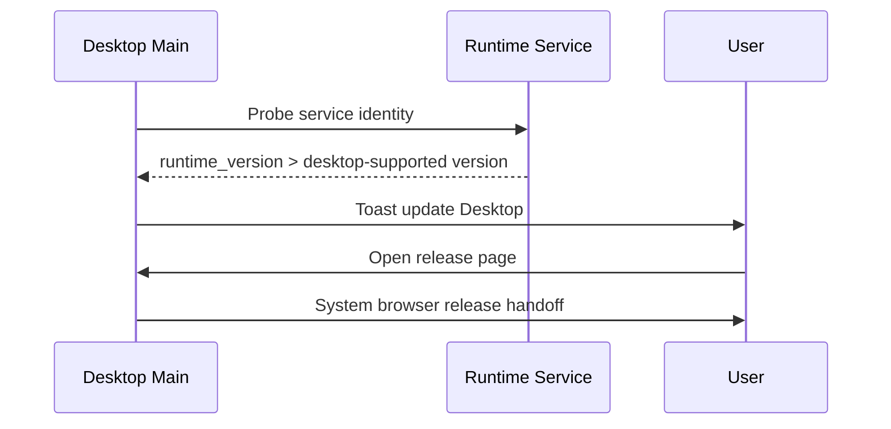

# Runtime Service Maintenance

Redeven Runtime is a persistent service, not a disposable helper process. Desktop
must expose that service model clearly while keeping version compatibility and
maintenance decisions product-owned instead of pushing component mechanics onto
users.

This document is the implementation plan and rollout checklist for the Runtime
Service Maintenance UX. The checklist is updated as the work lands so the
implementation remains traceable to the chosen product contract.

## Goals

- Present Runtime as a long-lived service that owns terminal, task, web service registration,
  and environment session continuity.
- Keep Desktop and Runtime version coordination safe, observable, and easy to
  recover from.
- Reuse the existing Desktop launcher and Env App settings visual language:
  compact cards, badges, table rows, action buttons, toast notifications, and
  confirmation dialogs.
- Avoid layout-shifting notices. Transient maintenance prompts must use toast
  surfaces or existing floating-layer components, never injected inline banners
  above page content.
- Prefer explicit data contracts over UI-only inference.

## Non-Goals

- Do not silently kill or replace a running Runtime service just because a newer
  bundled binary exists.
- Do not downgrade a newer Runtime to match an older Desktop shell.
- Do not add a second Desktop-specific runtime protocol. Local UI plus existing
  sys RPC remain the runtime authority.
- Do not introduce provider capability negotiation for this work.

## Product Model

The user-facing model has two first-class objects:

- `Redeven Desktop`: the app shell, connection center, windows, and provider
  management surface.
- `Runtime Service`: the persistent endpoint process that owns terminal
  sessions, workbench state, environment capability RPCs, and local/remote
  hosting.

The UI should say `Runtime Service` when describing lifecycle or maintenance,
and `Redeven Desktop` when describing the shell app release. Version decisions
remain automatic unless user confirmation is needed to protect live work.

## UX Principles

- Stable state belongs in stable UI slots: status badges, card facts, settings
  rows, and action menus.
- Ephemeral events use toast notifications. Toasts must not push page content
  down.
- Risky or disruptive operations use modal confirmation dialogs with impact
  details.
- Existing work keeps priority. A compatibility problem can block creating new
  sessions or using newer functionality, but should not close live terminals
  unless the user explicitly starts maintenance.
- Recovery actions must be verbs users understand: `Restart when idle`,
  `Restart now`, `Update Desktop`, `Open release page`, `Try again`, and
  `Copy diagnostics`.

## Data Structures

### Runtime Service Snapshot

Runtime exposes a normalized service snapshot through all attach and health
paths that Desktop can read before adopting a process:

```json
{
  "runtime_version": "v1.4.2",
  "runtime_commit": "abc123",
  "runtime_build_time": "2026-05-02T00:00:00Z",
  "protocol_version": "redeven-runtime-v1",
  "compatibility_epoch": 1,
  "service_owner": "desktop",
  "desktop_managed": true,
  "effective_run_mode": "hybrid",
  "remote_enabled": true,
  "compatibility": "compatible",
  "compatibility_message": "",
  "minimum_desktop_version": "v0.5.8",
  "minimum_runtime_version": "v0.5.8",
  "compatibility_review_id": "runtime-service-maintenance-v1",
  "active_workload": {
    "terminal_count": 3,
    "session_count": 2,
    "task_count": 0,
    "port_forward_count": 1
  }
}
```

Canonical TypeScript shape:

```ts
type RuntimeServiceOwner = 'desktop' | 'external' | 'unknown';
type RuntimeServiceCompatibility =
  | 'compatible'
  | 'update_available'
  | 'restart_recommended'
  | 'update_required'
  | 'desktop_update_required'
  | 'managed_elsewhere'
  | 'unknown';

type RuntimeServiceWorkload = {
  terminal_count: number;
  session_count: number;
  task_count: number;
  port_forward_count: number;
};

type RuntimeServiceIdentity = {
  runtime_version: string;
  runtime_commit: string;
  runtime_build_time: string;
  protocol_version: 'redeven-runtime-v1';
  compatibility_epoch: number;
  service_owner: RuntimeServiceOwner;
  desktop_managed: boolean;
  compatibility: RuntimeServiceCompatibility;
  compatibility_message: string;
  minimum_desktop_version: string;
  minimum_runtime_version: string;
  compatibility_review_id: string;
  active_workload: RuntimeServiceWorkload;
};
```

Compatibility is product-owned by the Runtime Service compatibility contract in
`internal/runtimeservice/compatibility_contract.json`. Runtime stamps the
contract's protocol version, compatibility epoch, minimum Desktop version,
minimum Runtime version, and review id into every Runtime Service snapshot.
Desktop and Env App render those fields as maintenance context; they should not
invent a second compatibility policy in UI-only code.

### Contract Carriers

- `runtime/local-ui.json`: persisted attach state used by Desktop before spawn.
- `--startup-report-file`: structured readiness report for a newly started
  desktop-managed process.
- `/api/local/runtime/health`: no-unlock health probe for attach viability.
- `/api/local/runtime`: unlocked local runtime info for Env App local mode.
- `sys.ping`: E2EE runtime RPC for Env App after the protocol is connected.

All carriers use `snake_case` on the wire and normalize to camelCase only inside
Env App protocol SDK types.

## Compatibility Decision Table

| State | User Impact | Primary UI |
| --- | --- | --- |
| `compatible` | No action needed | Stable badge/table row only |
| `update_available` | Optional maintenance | Toast once; Settings badge `Update ready` |
| `restart_recommended` | Continue work, plan restart | Toast; action `Restart when idle` |
| `update_required` | Existing work preserved; new risky actions blocked | Dialog-driven maintenance action |
| `desktop_update_required` | Runtime is newer than Desktop | Toast + release handoff; do not downgrade |
| `managed_elsewhere` | Desktop cannot own lifecycle | Stable card state + toast on blocked action |
| `unknown` | Metadata unavailable | Quiet degraded state; diagnostics available |

Desktop treats the runtime as a singleton per Local Environment profile. When a provider Environment reuses that singleton locally, the launcher `Open` action may start or restart the Desktop-managed runtime only when active work is empty. If active workload exists, Desktop keeps the action blocked until the user finishes or stops that work. External-managed runtimes stay outside Desktop ownership and are never silently replaced.

## Desktop Launcher UI

Desktop launcher cards keep their current dense SaaS tool layout:

- Status tone continues through `runtime_health` and existing action model.
- Runtime service facts appear in existing metadata/fact slots, not as new
  banners:
  - `Runtime Service`: `Running`, `Update ready`, `Restart recommended`,
    `Needs update`, `Update Desktop`, `Managed elsewhere`
  - `Version`: `v1.4.2`
  - `Active work`: `3 terminals, 1 web service`
- Primary actions remain route-aware:
  - compatible: `Open`
  - not running: `Open`
  - update required: `Open` with restart plan when idle
  - desktop too old: `Update Desktop`
  - managed elsewhere: `Open` stays blocked with owner guidance
- Action feedback continues through Desktop toasts. No launcher content should
  shift when a version event arrives.

## Env App Settings UI

The existing `Runtime Status` settings card remains the main detailed surface.
It should add rows instead of banners:

- `Service owner`
- `Compatibility`
- `Active work`
- `Runtime protocol`

Actions:

- `Restart runtime` opens a confirmation dialog before any restart request.
- `Update Redeven` opens the same impact dialog for self-upgrade.
- `Manage in Desktop` opens the Desktop update handoff for
  `desktop_release` policy.

Transient update prompts are toast-driven:

- automatic optional update: `Runtime update ready. Restart when your work is idle.`
- desktop-managed runtime: `Runtime is managed by Redeven Desktop. Use Desktop maintenance controls.`
- failure: `Runtime maintenance failed. Open Runtime Status for details.`

The automatic update floating prompt component is retired. Future explicit,
user-requested maintenance progress may use a dedicated surface only if it is
opened from a user action and never inserts content into the page layout.

## Confirmation Dialog Design

Title examples:

- `Restart Runtime Service?`
- `Update Runtime Service?`
- `Update Redeven Desktop?`

Body structure:

1. Short statement: `This Runtime Service is persistent and may have live work.`
2. Impact summary:
   - `3 terminal sessions`
   - `2 connected environment sessions`
   - `1 web service`
3. Version summary when relevant:
   - current runtime version
   - target runtime version
   - Desktop version handoff if runtime is desktop-managed
4. Actions:
   - `Restart now` / `Update now`
   - `Restart when idle` when implemented
   - `Cancel`

`Restart when idle` may initially be disabled with an explanatory tooltip if the
runtime lacks idle detection. The UI contract still reserves this action for the
future so the product model remains stable.

## Business Flow Sequences

### Desktop Attach



### Desktop-Managed Restart



### Self-Upgrade Runtime



### Runtime Newer Than Desktop



## Implementation Checklist

### Documentation

- [x] Add this design document with UX model, data structures, and sequence
  diagrams.
- [x] Update `docs/DESKTOP.md` with the Runtime Service Maintenance contract.
- [x] Update `docs/ENV_APP.md` with the toast/Dialog maintenance UI contract.
- [x] Update release/update wording if any release policy docs still imply
  desktop-managed runtime self-upgrades.
- [x] Add Runtime/Desktop compatibility release rules to `AGENTS.md` so future
  releases must update and review the contract before tagging.

### Runtime / Local UI

- [x] Add normalized Runtime Service snapshot/workload structs in
  `internal/runtimeservice`, and wire them through `internal/localui` and
  `internal/localui/runtime`.
- [x] Add a versioned compatibility contract in
  `internal/runtimeservice/compatibility_contract.json`.
- [x] Stamp compatibility epoch, minimum Desktop version, minimum Runtime
  version, and review id into every Runtime Service snapshot.
- [x] Add a release/source gate that verifies the compatibility contract and
  challenges unchanged compatibility windows before public tags.
- [x] Include service identity and workload in runtime state file writes.
- [x] Include service identity and workload in startup reports.
- [x] Include service identity and workload in `/api/local/runtime/health`.
- [x] Include service identity and workload in `/api/local/runtime`.
- [x] Extend `sys.ping` with the same service identity/workload data for Env
  App E2EE mode.
- [x] Source active terminal/session counts from runtime managers without
  introducing expensive polling or authorization leaks.
- [x] Normalize missing or partial snapshots with safe defaults so older or
  blocked paths degrade to `unknown` rather than breaking attach.

### Desktop Main / Launcher

- [x] Extend `StartupReport` parsing with runtime service identity/workload.
- [x] Extend desktop-managed and provider runtime state normalization.
- [x] Preserve runtime service metadata from saved Redeven URL and SSH health
  probes before a window is open.
- [x] Hydrate launcher runtime state from session and probe data.
- [x] Add service state/version/workload facts to environment card models.
- [x] Remove low-value `SOURCE` and `WINDOW` fact rows from launcher cards while
  keeping provider `SOURCE ENV` as the provider environment identifier.
- [x] Show `VERSION` for any runtime type when a Runtime Service snapshot is
  available, including Redeven URL and SSH runtimes.
- [x] Add compatibility-aware labels without inserting dynamic banners.
- [x] Route blocked maintenance-related launcher failures to existing toast
  delivery.

### Env App UI

- [x] Extend `SysPingResponse` SDK/codec with service identity/workload.
- [x] Expose service identity through `AgentVersionModel` or a dedicated
  maintenance model.
- [x] Replace automatic runtime update floating prompt with toast-driven
  notification behavior.
- [x] Add Runtime Status rows for service owner, compatibility, active work,
  and protocol.
- [x] Add confirmation dialog copy for restart/update impact.
- [x] Ensure existing buttons keep pointer cursor behavior through existing
  Button primitives and disabled states remain non-interactive.

### Tests

- [x] Add Go tests for runtime state serialization/parsing with service
  identity/workload.
- [x] Add Go tests for `/api/local/runtime/health`, `/api/local/runtime`, and
  `sys.ping` service identity payloads.
- [x] Add Desktop TS tests for startup parsing, welcome hydration, and card
  model facts.
- [x] Add Env App TS tests for sys codec, maintenance model, Runtime Status
  rows, and toast prompt behavior.
- [x] Update existing tests that assume update prompts render as floating
  windows.

### Final Review And Gates

- [x] Review changed code for consistency with this document and existing UI
  patterns.
- [x] Review `.md` docs for stale terminology (`agent` vs `Runtime Service`)
  where user-facing wording is involved.
- [x] Run targeted Go tests for touched packages.
- [x] Run targeted Desktop/Env App tests and typecheck where feasible.
- [x] Run broader local quality gates required by the touched surface when time
  permits.
- [x] Leave changes uncommitted in the feature worktree for review.
- [x] Start the dev Desktop app from the worktree for manual acceptance testing.
